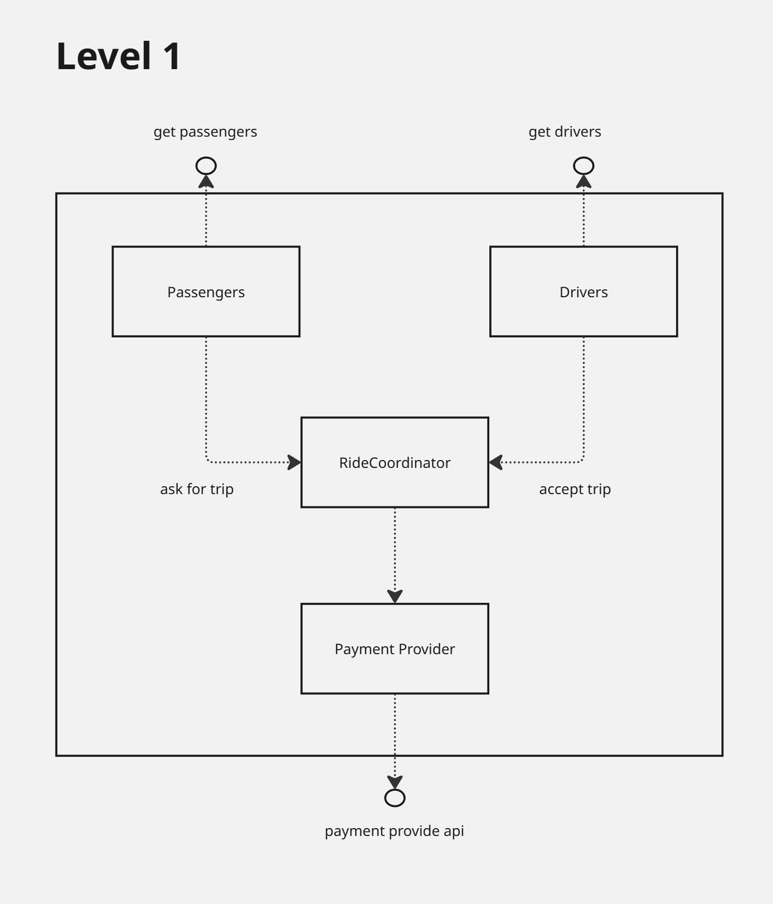
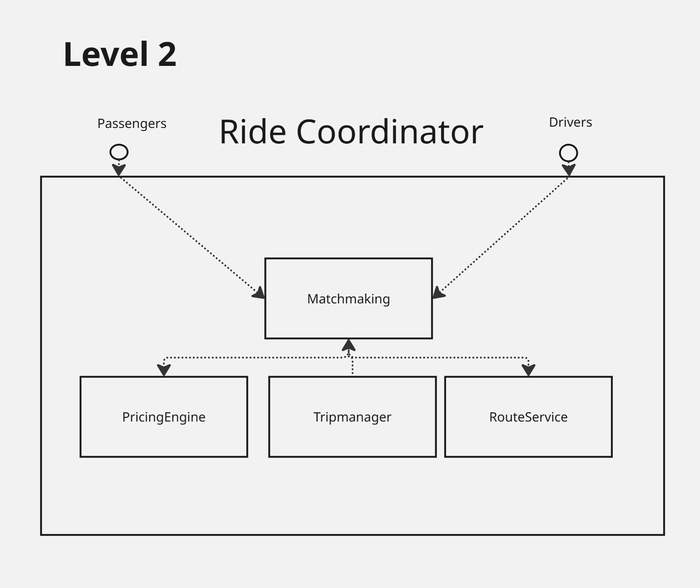
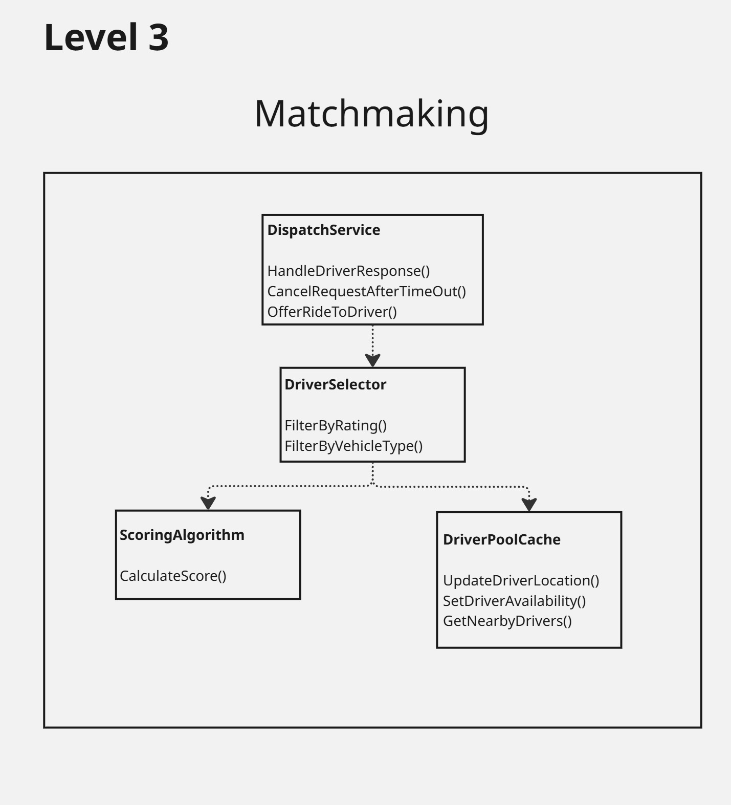

\newpage

# Building Block View

## White Box: Overall System

**Overview Diagram**  

**Motivation**  
At the top level, the system is divided into four key building blocks:
- Passengers
- Drivers
- Ride Coordinator
- Payment Provider

This clear separation of concerns supports scalability and simplifies maintenance.

**Contained Building Blocks**

| Name             | Responsibility                                                          |
|------------------|--------------------------------------------------------------------------|
| Passengers       | Enables passengers to request trips and communicate with the system.     |
| Drivers          | Enables drivers to accept trips and provide transportation services.     |
| Ride Coordinator | Orchestrates trip requests, driver matching, and payment processing.     |
| Payment Provider | Manages secure payment transactions with external payment services.      |

## White Box: Ride Coordinator

**Overview Diagram**  

**Motivation**  
The Ride Coordinator is further decomposed into focused services:
- Matchmaking
- Pricing Engine
- Trip Manager
- Route Service

This modularization allows independent scaling and development.

**Contained Building Blocks**

| Name          | Responsibility                                                              |
|---------------|------------------------------------------------------------------------------|
| Matchmaking   | Matches passengers with suitable drivers.                                    |
| Pricing Engine| Dynamically calculates trip fares based on distance, demand, etc.            |
| Trip Manager  | Manages the trip lifecycle (creation, updates, completion).                  |
| Route Service | Provides optimal routing and navigation for trips.                           |

## White Box: Matchmaking

**Overview Diagram**  

**Motivation**  
The Matchmaking component is detailed to show its internal structure for optimal driver-passenger pairing.  
It consists of dispatch logic, driver selection, scoring, and real-time driver pool management.

**Contained Building Blocks**

| Name             | Responsibility                                                                   |
|------------------|-----------------------------------------------------------------------------------|
| Dispatch Service | Manages driver responses, cancellations, and offers rides to drivers.             |
| Driver Selector  | Filters drivers by rating, vehicle type, and other constraints.                   |
| Scoring Algorithm| Calculates scores for potential matches to optimize match quality.                |
| Driver Pool Cache| Keeps real-time data of driver locations, availability, and proximity searches.   |

# Important Interfaces

- **Passenger API:** Interface for passengers to request trips and receive status updates.
- **Driver API:** Interface for drivers to accept/reject trips and update availability.
- **Payment Provider API:** Secure integration with external payment gateways for processing payments.
